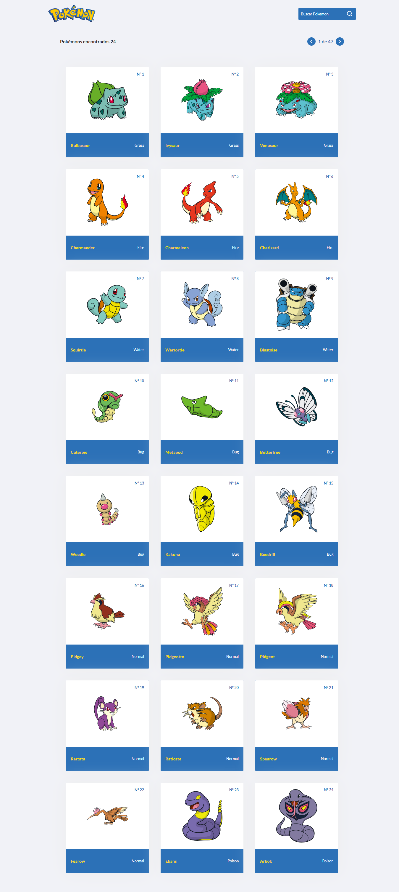
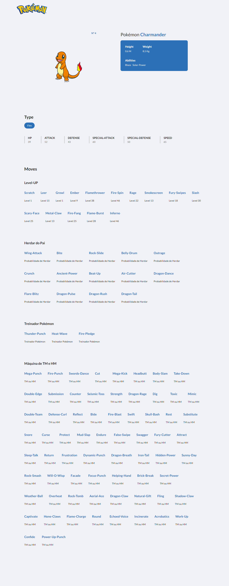

<h1 align="center">
    
    <br>
    Pokédex
</h1>

<h4 align="center">
  Pokédex - List of pokemons with move and stat information
</h4>

<p align="center">
  <a href="#technologies">Technologies</a>&nbsp;&nbsp;&nbsp;|&nbsp;&nbsp;&nbsp;
  <a href="#information_source-how-to-use">How To Use</a>&nbsp;&nbsp;&nbsp;|&nbsp;&nbsp;&nbsp;
  <a href="">License</a>&nbsp;&nbsp;&nbsp;|&nbsp;&nbsp;&nbsp;
  <a href="#links">Links</a>
</p>

## Home

<p align="center">
  
</p>

## Pokemon Stats

<p align="center">
  
</p>

## Technologies

This project was developed for learning with the following technologies:

-   [Typescript](https://www.typescriptlang.org/)
-   [ReactJS](https://reactjs.org/)
-   [NextJS](https://nextjs.org/)
-   [Axios](https://github.com/axios/axios)
-   [styled-components](https://www.styled-components.com/)
-   [react-icons](https://react-icons.github.io/react-icons)
-   [VS Code][vc] and [ESLint][vceslint]

## How To Use

To clone and run this application, you'll need [Git](https://git-scm.com), [Node.js v16.14][nodejs] or higher + [Yarn v1.22][yarn] or higher installed on your computer. From your command line:

```bash
# Clone this repository
$ git clone https://github.com/brunorguerra/pokedex

# Go into the repository
$ cd pokedex

# Install dependencies
$ yarn install

# Run the app
$ yarn dev

# enter your browser and access
$ http://localhost:3000/
```

## Links

-   Link: https://app-pokedex-alpha.vercel.app/
-   Repository: https://github.com/brunorguerra/pokedex
    -   In case of sensitive bugs like security vulnerabilities, please contact
        brunoguerracontact@gmail.com directly instead of using issue tracker. We value your effort
        to improve the security and privacy of this project!

<!-- ## License

This project is under the MIT license. See the [LICENSE]() for more information. -->

---

Made with ♥ by Bruno Guerra [Get in touch!](https://www.linkedin.com/in/brunorguerra/)

[nodejs]: https://nodejs.org/
[yarn]: https://yarnpkg.com/
[vc]: https://code.visualstudio.com/
[vceslint]: https://marketplace.visualstudio.com/items?itemName=dbaeumer.vscode-eslint
